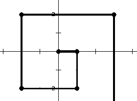
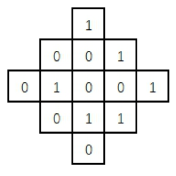

**第 1 题**

在 8 位二进制补码中，10101011 表示的数是十进制下的（ ）。

1.  A. 43 B. -85 C. -43 D. -84

   正确答案： B


**第 2 题**

计算机存储数据的基本单位是（ ）。

1.  A. bit B. Byte  C. GB D. KB

   正确答案： B


**第 3 题**

下列协议中与电子邮件无关的是（ ）。

1.  A. POP3 B. SMTP  C. WTO D. IMAP

   正确答案： C


**第 4 题**

分辨率为 800x600、16 位色的位图，存储图像信息所需的空间为（ ）。

1.  A. 937.5KB B. 4218.75KB  C. 4320KB D. 2880KB

   正确答案： A


**第 5 题**

计算机应用的最早领域是（ ）。

1.  A. 数值计算 B. 人工智能  C. 机器人 D. 过程控制

   正确答案： A


**第 6 题**

下列不属于面向对象程序设计语言的是（ ）。

1.  A. C B. C++  C. Java D. C#

   

**第 7 题**

NOI 的中文意思是（ ）。

1.  A. 中国信息学联赛 B. 全国青少年信息学奥林匹克竞赛 C. 中国青少年信息学奥林匹克竞赛  D. 中国计算机协会

   正确答案： B


**第 8 题**

2017 年 10 月 1 日是星期日，1999 年 10 月 1 日是（ ）。

1.  A. 星期三 B. 星期日  C. 星期五 D. 星期二

   正确答案： C


**第 9 题**

甲、乙、丙三位同学选修课程，从 4 门课程中，甲选修 2 门，乙、丙各选修3门，则不同的选修方案共有（ ）种。

1.  A. 36 B. 48  C. 96 D. 192

   正确答案： C


**第 10 题**

设 G 是有 n 个结点、m 条边（n ≤ m）的连通图，必须删去 G 的（ ）条边，才能使得 G 变成一棵树。

1.  A. m – n + 1 B. m - n  C. m + n + 1 D. n – m + 1

   正确答案： A


**第 11 题**

对于给定的序列{ak}，我们把 (i, j) 称为逆序对当且仅当 i < j 且 ai > aj。那么 序列 1, 7, 2, 3, 5, 4 的逆序对数为（ ）个。

1.  A. 4 B. 5  C. 6 D. 7

   正确答案： B


**第 12 题**

表达式 a * (b + c) * d 的后缀形式是（ ）。

1.  A. a b c d * + * B. a b c + * d *  C. a * b c + * d D. b + c * a * d

   正确答案： B


**第 13 题**

向一个栈顶指针为 hs 的链式栈中插入一个指针 s 指向的结点时，应执行（ ）。

1.  A. hs->next = s; B. s->next = hs; hs = s; C. s->next = hs->next; hs->next = s;  D. s->next = hs; hs = hs->next;

   正确答案： B


**第 14 题**

若串 S = “copyright”，其子串的个数是（ ）。

1.  A. 72 B. 45  C. 46 D. 36

   正确答案： C


**第 15 题**

十进制小数 13.375 对应的二进制数是（ ）。

1.  A. 1101.011 B. 1011.011  C. 1101.101 D. 1010.01

   正确答案： A


**第 16 题**

对于入栈顺序为 a, b, c, d, e, f, g 的序列，下列（ ）不可能是合法的出栈序列。

1.  A. a, b, c, d, e, f, g B. a, d, c, b, e, g, f   C. a, d, b, c, g, f, e D. g, f, e, d, c, b, a

   正确答案： C


**第 17 题**

设 A 和 B 是两个长为 n 的有序数组，现在需要将 A 和 B 合并成一个排好序的数组，任何以元素比较作为基本运算的归并算法在最坏情况下至少要做（ ）次比较。

1.  A. n^{2}*n*2 B. n log n  C. 2n D. 2n - 1

   正确答案： D


**第 18 题**

从（ ）年开始，NOIP 竞赛将不再支持 Pascal 语言。

1.  A. 2020 B. 2021  C. 2022 D. 2023

   正确答案： C


**第 19 题**

一家四口人，至少两个人生日属于同一月份的概率是（ ）（假定每个人生日属于每个月份的概率相同且不同人之间相互独立）。

1.  A. 1/12 B. 1/144  C. 41/96 D. 3/4

   正确答案： C


**第 20 题**

以下和计算机领域密切相关的奖项是（ ）。

1.  A. 奥斯卡奖 B. 图灵奖  C. 诺贝尔奖 D. 普利策奖

   正确答案： B


**第 21 题**

一个人站在坐标（0, 0）处，面朝 x 轴正方向。第一轮，他向前走 1 单位距离，然后右转；第二轮，他向前走 2 单位距离，然后右转；第三轮，他向前走 3 单位距离，然后右转……他一直这么走下去。请问第 2017 轮后，他的坐标是：（ _________ , _________ ）。（请在答题纸上用逗号隔开两空答案）



1. 正确答案： 1009,1008


**第 22 题**

如下图所示，共有 13 个格子。对任何一个格子进行一次操作，会使得它自己以及与它上下左右相邻的格子中的数字改变（由 1 变 0，或由 0 变 1）。现在要使得所有的格子中的数字都变为 0，至少需要_________次操作。



1. 正确答案： 3


**第 23 题**

** 阅读程序写结果: **

```
#include<iostream>
using namespace std;
int main()
{
    int t[256];
    string s;
    int i;
    cin >> s;
    for (i = 0; i < 256; i++)
        t[i] = 0;
    for (i = 0; i < s.length(); i++)
        t[s[i]]++;
    for (i = 0; i < s.length(); i++)
        if (t[s[i]] == 1)
        {
            cout << s[i] << endl;
            return 0;
        }
    cout << "no" << endl;
    return 0;
}
```

输入：xyzxyw
输出：_________

1. 正确答案： z


**第 24 题**

**阅读程序写结果: **

```
#include<iostream>
using namespace std;
int g(int m, int n, int x)
{
    int ans = 0;
    int i;
    if (n == 1)
        return 1;
    for (i = x; i <= m / n; i++)
        ans += g(m - i, n - 1, i);
    return ans;
}
int main()
{
    int t, m, n;
    cin >> m >> n;
    cout << g(m, n, 0) << endl;
    return 0;
}
```

输入：7 3
输出：_________

1. 正确答案： 8


**第 25 题**

**阅读程序写结果: **

```
#include<iostream>
using namespace std;
int main()
{
    string ch;
    int a[200];
    int b[200];
    int n, i, t, res;
    cin >> ch;
    n = ch.length();
    for (i = 0; i < 200; i++)
        b[i] = 0;
    for (i = 1; i <= n; i++)
    {
        a[i] = ch[i - 1] - '0';
        b[i] = b[i - 1] + a[i];
    }
    res = b[n];
    t = 0;
    for (i = n; i > 0; i--)
    {
        if (a[i] == 0)
            t++;
        if (b[i - 1] + t < res)
            res = b[i - 1] + t;
    }
    cout << res << endl;
    return 0;
}
```

输入：1001101011001101101011110001
输出：_________

1. 正确答案： 11


**第 26 题**

** 阅读程序写结果 **

```
#include<iostream>
using namespace std;
int main()
{
    int n, m;
    cin >> n >> m;
    int x = 1;
    int y = 1;
    int dx = 1;
    int dy = 1;
    int cnt = 0;
    while (cnt != 2)
    {
        cnt = 0;
        x = x + dx;
        y = y + dy;
        if (x == 1 || x == n)
        {
            ++cnt;
            dx = -dx;
        }
        if (y == 1 || y == m)
        {
            ++cnt;
            dy = -dy;
        }
    }
    cout << x << " " << y << endl;
    return 0;
}
```

输入 1：4 3
输出 1：_________（3 分）

输入 2：2017 1014
输出 2：_________（5 分）

1. 1.

   正确答案： 1 3

2. 2.

   正确答案： 2017 1


**第 27 题**

**完善程序：**
**（快速幂）** 请完善下面的程序，该程序使用分治法求x^{p}\ mod\ m*x**p* *m**o**d* *m* 的值。（第一空 2 分，其余 3 分）

输入：三个不超过 10000 的正整数 x，p，m。
输出：x^{p}\ mod\ m*x**p* *m**o**d* *m*的值。
提示：若 p*p* 为偶数，x^{p}=(x^{2})^{p/2}*x**p*=(*x*2)*p*/2；若 p*p* 为奇数，x^{p}=x^{*}(x^{2})^{(p-1)/2}*x**p*=*x*∗(*x*2)(*p*−1)/2。

```
#include<iostream>
using namespace std;
int x, p, m, i, result;
int main(){
	cin >> x >> p >> m;
	result = ①;
	while (②){
		if (p % 2 == 1)
			result = ③;
		p /= 2;
		x = ④;
	}
	cout << ⑤ << endl;
	return 0;
}
```

1. 1.

   正确答案： 1

2. 2.

   正确答案： p>0 / p!=0 / p

3. 3.

   正确答案： result * x % m

4. 4.

   正确答案： x * x % m

5. 5.

   正确答案： result


**第 28 题**

**完善程序：**
**（切割绳子）** 有 n 条绳子，每条绳子的长度已知且均为正整数。绳子可以以任意正整数长度切割，但不可以连接。现在要从这些绳子中切割出 m 条长度相同的绳段，求绳段的最大长度是多少。（第一、二空 2.5 分，其余 3 分）

输入：第一行是一个不超过 100 的正整数 n，第二行是 n 个不超过10^{6}106的正整数，表示每条绳子的长度，第三行是一个不超过10^{8}108的正整数 m。 输出：绳段的最大长度，若无法切割，输出 **Failed**。

```
#include<iostream>
using namespace std;
int n, m, i, lbound, ubound, mid, count;
int len[100]; // 绳子长度
int main()
{
    cin >> n;
    count = 0;
    for (i = 0; i < n; i++)
    {
        cin >> len[i];
        ①;
    }
    cin >> m;
    if (②)
    {
        cout << "Failed" << endl;
        return 0;
    }
    lbound = 1;
    ubound = 1000000;
    while (③)
    {
        mid = ④;
        count = 0;
        for (i = 0; i < n; i++)
            ⑤;
        if (count < m)
            ubound = mid - 1;
        else
            lbound = mid;
    }
    cout << lbound << endl;
    return 0;
}
```

1. 1.

   正确答案： count=count+len[i] / count+=len[i]

2. 2.

   正确答案： count<m / m>count

3. 3.

   正确答案： lbound<ubound / ubound>lbound

4. 4.

   正确答案： (lbound+ubound+1)/2 / (lbound+ubound+1)>>1 / (lbound+ubound)/2+1

5. 5.

   正确答案： count=count+len[i]/mid / count+=len[i]/mid


