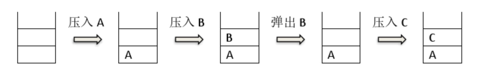

第 1 题
以下哪一种设备属于输出设备

 A. 扫描仪
 B. 键盘
 C. 鼠标
 D. 打印机

正确答案： D


第 2 题
下列四个不同进制的数中，与其它三项数值上不相等的是

 A. (269)16
 B. (617)10
 C. (1151)8
 D. (1001101011)

正确答案： D


第 3 题
1MB 等于（ ）

 A. 1000 字节
 B. 1024 字节
 C. 1000 X 1000 字节
 D. 1024 X 1024 字节

正确答案： D


第 4 题
广域网的英文缩写是（ ）

 A. LAN
 B. WAN
 C. MAN
 D. LNA

正确答案： B


第 5 题
中国计算机学会于（ ）年创办全国青少年计算机程序设计竞赛。

 A. 1983
 B. 1984
 C. 1985
 D. 1986

正确答案： B

第 6 题
如果开始时计算机处于小写输入状态，现在有一只小老鼠反复按照CapsLock、 字母键A、字母键 S、字母键D、字母键 F 的顺序循环按键，即 CapsLock、A、 S、D、F、CapsLock、A、S、D、F、……，屏幕上输出的第 81 个字符是字母 （ ）

 A. A
 B. S
 C. D
 D. a

正确答案： A


第 7 题
根节点深度为 0，一棵深度为 h 的满 k（k>1）叉树，即除最后一层无任何子 节点外，每一层上的所有结点都有 k 个子结点的树，共有（ ）个结点。

 A. (k^{h+1}-1)/(k-1)(k 
h+1
 −1)/(k−1)

B. k^{h-1}k 
h−1

 C. k^hk 
h

 D. (k^{h-1})/(k-1)(k 
h−1
 )/(k−1)

正确答案： A


第 8 题
以下排序算法中，不需要进行关键字比较操作的算法是（ ）。

 A. 基数排序
 B. 冒泡排序
 C. 堆排序
 D. 直接插入排序

正确答案： A


第 9 题
给定一个含N 个不相同数字的数组，在最坏情况下，找出其中最大或最小的 数，至少需要 N - 1 次比较操作。则最坏情况下，在该数组中同时找最大与 最小的数至少需要（ ）次比较操作。（⌈ ⌉表示向上取整，⌊ ⌋表示向下取整）

 A. ⌈3N / 2⌉ - 2
 B. ⌊3N / 2⌋ - 2
 C. 2N - 2
 D. 2N - 4

正确答案： A


第 10 题
下面的故事与（ ）算法有着异曲同工之妙。

从前有座山，山里有座庙，庙里有个老和尚在给小和尚讲故事：“从前有座山，山里有座庙，庙里有个老和尚在给小和尚讲故事：‘从前有座山，山里有座庙，庙里有个老和尚给小和尚讲故事……’”

 A. 枚举
 B. 递归
 C. 贪心
 D. 分治

正确答案： B


第 11 题
由四个没有区别的点构成的简单无向连通图的个数是（ ）。

 A. 6
 B. 7
 C. 8
 D. 9

正确答案： A


第 12 题
设含有10 个元素的集合的全部子集数为 S，其中由 7 个元素组成的子集数为 T，则 T / S 的值为（ ）。

 A. 5 / 32
 B. 15 / 128
 C. 1 / 8
 D. 21 / 128

正确答案： B


第 13 题
10000 以内，与 10000 互质的正整数有（ ）个。

 A. 2000
 B. 4000
 C. 6000
 D. 8000

正确答案： B


第 14 题
为了统计一个非负整数的二进制形式中 1 的个数，代码如下：

int CountBit(int x)
{
	int ret = 0;
	while (x)
	{
		ret++;
		___________;
	}
	return ret;
}
则空格内要填入的语句是（ ）。

 A. x >>= 1
 B. x &= x - 1
 C. x |= x >> 1
 D. x <<= 1

正确答案： B


第 15 题
下图中所使用的数据结构是（ ）。



 A. 哈希表
 B. 栈
 C. 队列
 D. 二叉树

正确答案： B


第 16 题
甲乙丙丁四人在考虑周末要不要外出郊游。

已知①如果周末下雨，并且乙不去，则甲一定不去；②如果乙去，则丁一定去；③如果丙去，则丁一定不去；④如果丁不去，而且甲不去，则丙一定不去。

如果周末丙去了，则甲________，乙________，丁________，周末________。

1.
 A. 去了
 B. 没去
正确答案： A

2.
 A. 去了
 B. 没去
正确答案： B

3.
 A. 去了
 B. 没去
正确答案： B

4.
 A. 下雨
 B. 没下雨
正确答案： B


第 17 题
从 1 到 2018 这 2018 个数中，共有__________个包含数字 8 的数。

正确答案： 544


第 18 题
阅读程序写结果:

```
#include <stdio.h>
char st[100];

int main() {
	scanf("%s", st);
	for (int i = 0; st[i]; ++i) {
		if (‘A’ <= st[i] && st[i] <= ‘Z’)
		st[i] += 1;
	}
	printf("%s\n", st);
	return 0;
}
```

输入：QuanGuoLianSai


正确答案： RuanHuoMianTai

第 19 题
阅读程序写结果:

```
#include <stdio.h>
int main() {
	int x;
    scanf("%d", &x);
    int res = 0;
    for (int i = 0; i < x; ++i) {
      	if (i * i % x == 1) {
      		++res;
      	}
    }
    printf("%d", res);
    return 0;
}
```


输入：15

正确答案： 4


第 20 题
阅读程序写结果:

```
#include <iostream>
using namespace std;
int n, m;

int findans(int n, int m) {
    if (n == 0) return m;
    if (m == 0) return n % 3;
    return findans(n - 1, m) - findans(n, m - 1) + findans(n - 1, m - 1);
}

int main(){
    cin >> n >> m;
    cout << findans(n, m) << endl;
    return 0;
}
```

输入：5 6

正确答案： 8


第 21 题
阅读程序写结果:

```
#include <stdio.h>
int n, d[100];
bool v[100];

int main() {
    scanf("%d", &n);
    for (int i = 0; i < n; ++i) {
        scanf("%d", d + i);
        v[i] = false;
    }
    int cnt = 0;
    for (int i = 0; i < n; ++i) {
        if (!v[i]) {
        	for (int j = i; !v[j]; j = d[j]) {
        		v[j] = true;
        	}
        	++cnt;
        }
    }
    printf("%d\n", cnt);
    return 0;
}
```

输入：10 7 1 4 3 2 5 9 8 0 6


正确答案： 6


第 22 题
完善程序

（最大公约数之和）下列程序想要求解整数𝑛的所有约数两两之间最大公约数的和对 10007 求余后的值，试补全程序。（第一空2 分，其余 3 分）举例来说，4 的所有约数是 1, 2, 4 。1 和 2 的最大公约数为 1 ；2 和 4 的最大公约数为 2 ；1 和 4 的最大公约数为 1 。于是答案为1 + 2 + 1 = 4。

要求getDivisor 函数的复杂度为𝑂(√𝑛)，gcd 函数的复杂度为𝑂(log max(𝑎, 𝑏))。

```
#include <iostream>
using namespace std;

const int N = 110000, P = 10007;
int n;
int a[N], len;
int ans;

void getDivisor() {
    len = 0;
    for (int i = 1; ① <= n; ++i)
        if (n % i == 0) {
          a[++len] = i;
          if ( ② != i) a[++len] = n / i;
        }
}

int gcd(int a, int b) {
    if (b == 0) {
    	③ ;
    }
    return gcd(b, ④ );
}

int main() {
    cin >> n;
    getDivisor();
    ans = 0;
    for (int i = 1; i <= len; ++i) {
        for (int j = i + 1; j <= len; ++j) {
        	ans = ( ⑤ ) % P;
        }
    }
    cout << ans << endl;
    return 0;
}
```

1.
正确答案： i*i

2.
正确答案： n/i

3.
正确答案： return a

4.
正确答案： a%b

5.
正确答案： ans + gcd(a[i], a[j])


第 23 题
对于一个 1 到 n 的排列 P（即 1 到 n 中每一个数在 P 中出现了恰好一次），令 q[i] 为第 i 个位置之后第一个比 P[i] 值更大的位置，如果不存在这样的位置，则 q[i] = n + 1。举例来说，如果 n = 5 且 P 为 1 5 4 2 3 ，则 q 为2 6 6 5 6。

下列程序读入了排列 P ，使用双向链表求解了答案。试补全程序。

```
#include <iostream>
using namespace std;

const int N = 100010;
int n;
int L[N], R[N], a[N];

int main() {
    cin >> n;
    for (int i = 1; i <= n; ++i) {
        int x;
        cin >> x;
        ① ;
    }
    
for (int i = 1; i <= n; ++i) {
    R[i] = ② ;
    L[i] = i - 1;
}

for (int i = 1; i <= n; ++i) {
    L[ ③ ] = L[a[i]];
    R[L[a[i]]] = R[ ④ ];
}

for (int i = 1; i <= n; ++i) {
	cout << ⑤ << " ";
}

cout << endl;
return 0;

}
```

1.
正确答案： a[x] = i

2.
正确答案： i+1

3.
正确答案： R[a[i]]

4.
正确答案： a[i]

5.
正确答案： R[i]

