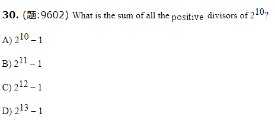
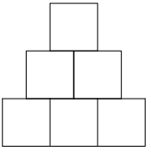

2015-2016年度美国“数学大联盟杯赛”（中国赛区）初赛题解

**1.** (题:9618) A 6 by 6 square has the same area as a 4 by  ?  rectangle.

A) 3 B) 6 C) 8 D) 9

 D   知识点: 计算矩形的周长与面积, 计算正方形的周长与面积    难度: 1

**2.** (题:9617) Every  prime has exactly  ?  positive divisors.

A) 1 B) 2 C) 3 D) 4 or more

B  知识点: 质数、合数与分解质因数, 约数与倍数    难度: 1

**3.** (题:9616) If I  answered 34 out of 40 questions  on my math test correctly, I answered  ? % of the questions  correctly.

A) 75 B) 80 C) 85 D) 90

C  知识点: 分数、百分数应用题    难度: 2

**4.** (题:9615) 120 ÷ 3 ÷ 4 × 12 =

A) 1 B) 10 C) 12 D) 120

D  知识点: 四则运算    难度: 1

**5.** (题:9614) 10 × 20 × 30 × 40 = 24 ×   ?  

A) 1000 B)  10 000 C) 100 000 D) 1000 000

B  知识点: 四则运算    难度: 2

**6.** (题:9613) One of my  boxes contains 1 pencil and the others each contain  5 pencils. If there are 101 pencils in my boxes, how many boxes    do I have?

A) 19 B) 20 C) 21 D) 22

C  知识点: 一元一次方程    难度: 1

**7.** (题:9579) An  electrical company imports 2016 light bulbs. Unfortunately, 25% of those  are damaged. How many light bulbs are  **not** damaged?

A) 25 B) 504 C) 1512 D) 2016

C  知识点: 分数、百分数应用题    难度: 2

**8.** (题:9580) 50 × (16 + 24) is the square  of

A) -40 B) -4 C) 4 D) 80

A  知识点: 四则运算    难度: 3

**9.** (题:9581) Which of the  following numbers has exactly 3 positive divisors?

A) 49 B) 56 C) 69 D) 100

A  知识点: 约数与倍数    难度: 3

**10.** (题:9582) Ten  people stand in a line. Counting  from the left, Jerry stands at the 5th position. Counting  from the right, which position is he at?

A) 4 B) 5 C) 6 D) 7

C  知识点: 推理    难度: 2

**11.** (题:9583) On a   teamwork project, Jack contributed   2/7 of the total amount of work, Jill   contributed  1/4 of the work, Pat  contributed 1/5 of the work, and Matt  contributed  the rest. Who  contributed  the most toward this project?

A) Jack B) Jill C) Pat D)  Matt

A知识点: 分数、百分数应用题    难度: 4

**12.** (题:9584) Which of the  following numbers is a factor of 2016?

A) 5 B) 11 C) 48 D) 99

C  知识点: 约数与倍数    难度: 2

**13.** (题:9585) 2 × 4 × 8 × 16 × 32 × 64 =

A) 210 B) 215 C) 221 D) 2120

C  知识点: 幂的运算    难度: 4

**14.** (题:9586) On a  game show, Al won four times as much as Bob, and Bob won four  times as much as Cy. If Al won $1536, how much did Al, Bob, and Cy win together?

A) $96 B) $384 C) $1920 D) $2016

D  知识点: 一元一次方程    难度: 4

**15.** (题:9587) The sum of two  composites *cannot* be

 A) odd B) even C) 11 D) 17

C  知识点: 存在性    难度: 4

**16.** (题:9588) If *a* and *b* are  positive integers such that *a*/*b* = 5/7, then  *a* + *b* is

A) 12 B) 24 C) 36 D) not able to be determined

 D  知识点: 分数百分数    难度: 4

**17.** (题:9589) What is the  greatest odd factor of the number of hours in all the days of the year 2015?

A) 3 B) 365 C) 1095 D) 3285

C  知识点: 奇数、偶数与奇偶性的应用, 约数与倍数    难度: 3

**18.** (题:9590) If the  current month is February, what month will it be 1 199 999 months from now?

A) January B) February C) March D) April

A  知识点: 余数问题    难度: 3

**19.**  (题:9591)Two angles are complementary. One of these angles is 36° less than the other. What is the measure of the larger angle?

A) 36° B) 54° C) 63° D) 72°

C  知识点: 和差问题    难度: 3

**20.** (题:9592) (The  square root of 16) + (the cube root of 64) + (the 4th root of 256) =

A) 12 B) 24 C) 32 D) 64

A  知识点: 四则运算    难度: 3

**21.** (题:9593) In ∆*ABC*, *m*∠*A* – *m*∠*B* = *m*∠*B* – *m*∠*C*.  what is the degree measure of ∠*B*?

A) 30 B) 60 C) 90 D) 120

B  知识点: 角度    难度: 4

**22.** (题:9594) For every 3 math books I bought, I bought 2  biology books. I bought 55 books in all. How many of those are math books?

A) 11 B) 22 C) 33 D) 44

C  知识点: 比例类    难度: 3

**23.** (题:9595) John  wrote a  number whose digits consists  entirely of 1s. This  number was a composite number. His number could contain exactly   ?   1s.

A) 17 B) 19 C) 29 D) 32

D  知识点: 约数与倍数    难度: 4

**24.** (题:9596) Weird Town  uses three types of currencies: Cons, Flegs, and Sels. If 3 Sels  = 9  Cons and 2 Cons  = 4 Flegs, then 5 Sels  =   ?   Flegs.

A) 12 B) 24 C) 30 D) 36

C  知识点: 转化    难度: 4

**25.** (题:9597) If the  length of a rectangular prism with volume  *V* is  double while the width and the height are halved, the volume of the new prism will be

A) 4*V*  B) *V*/2  C) *V*  D) 2*V*

B  知识点: 棱柱, 体积    难度: 4  

**26.** (题:9598) Rick and Roy each stands at different ends of a straight road  that is 64 m long. They run toward  each other. Rick’s speed is 3 m/s and Roy’s  speedis 5 m/s. They will meet  in   ?   seconds.

A) 1 B) 2 C) 4 D) 8

D  知识点: 相遇和追及    难度: 2

**27.** (题:9599) If the  area of a certain circle is 2016, its radius is

A) sqrt (2016/π) B) sqrt (4032/π) C) 2016/π D) 1008/π

A  知识点: 与圆有关的计算    难度: 3

**28.** (题:9600) In a toy shop, the  cost of a Teddy Bear is 200% as much as  that of a toy train. The cost of a toy train is 6/5 the  cost of a pack of the wooden blocks. The  cost of a pack of wooden blocks is $50.  What is the cost, in dollars, of the Teddy Bear?

A) 60 B) 100 C) 120 D) 200

C  分数、百分数应用题    难度: 4

**29.** (题:9601) In the sequence  2016, 225, 141, 66, 432, 99, 1458 …, each term after the first  term is the sum of the cubes of the digits of the  previous term. What is the 100th term of  this sequence?

A) 153 B) 351 C) 370 D) 371

A  知识点: 递推式    难度: 4

 

**30.**   B    知识点: 幂的运算, 约数与倍数    难度: 4

**31.** (题:9603) It takes 4 hours for Mike  and  Lucy to finish a task. It  takes Lucy and  Jerry 5 hours to finish the same task. And it  takes 6 hours for  Mike and  Jerry to finish the same  task. Lucy and Jery first work on the task for 1 hour and 45 minutes. Then Mike takes    over the task on his own. How  many more hours does it take for Mike to finish the task?

A) 3 B) 4 C) 5 D) 6

D  知识点: 工程问题    难度: 4

**32.** (题:9604) If you  sell a cloth at its  current price, you get $40 profit. The total  profit you get  selling 10 clothes at 70% of its  current price is equal to the  total profit you get selling  20 clothes at $82 per cloth. What is the current  price of a cloth?

A) 80 B) 100 C) 120 D) 125

B  知识点: 利润问题    难度: 4

**33.** (题:9605) There are 6 identical  squares in the figure below. The side length of each square is 1. Of all the  triangles constructed by connecting three of the 18 vertices in the figure, how many of them are  triangles whose  area is 2 and which has at least one  vertical or horizontal side?

A) 12 B) 16 C) 24 D) 28

C  知识点: 枚举法, 面积    难度: 4

**34.** (题:9606) Pick up *N* numbers  from 1 to 2015 inclusively, such that the sum of any three of the *N* numbers is  by 24. What is the maximum value of *N*?

A) 83 B) 84 C) 168 D) 252

B 知识点: 枚举法, 面积    难度: 4

**35.** (题:9607) 汤姆有一件花了64美金买来的衬衫，他打算以比原价高出25%的价格出售，他会卖出多少钱？

A) $16 B) $32 C) $48 D) $80

D  知识点: 分数、百分数应用题    难度: 2

**36.** (题:9608) 满足以下条件的最小整数是多少：“除以3余2，除以5余4，除以7余6。”

A) 59 B) 61 C) 104 D) 106

C  知识点: 带余除法    难度: 3

**37.** (题:9609) 飞人以每小时360千米的速度飞行，这相当于每秒多少米？

A) 10 B) 36 C) 64 D) 100

D知识点: 转化, 比例类    难度: 4

**38.** (题:9610) 设*A*为一个可整除11但不可整除10的正整数，若*B*为一个颠倒*A*数位的整数，那么*B*必须被几整除？

A) 11 B) 22 C) 33 D) A, B, C都不选

A  知识点: 数的整除    难度: 3

**39.** (题:9611) 珍妮花50美金买了一条围巾。她一开始准备以60美金卖出，然后把价格增加25%，再把新的价格减少20%并且出售。在这笔交易之中，她   ?  。

A) 赚了7美金 B) 赚了10美金 C) 亏了7美金 D) 亏了10美金

B  知识点: 分数、百分数应用题, “盈亏”型    难度: 4

**40.** (题:9612) *A*,*B*两个袋子里分别有若干个球，*A*袋球和*B*袋球的数量比是4:1。从*A*袋中取出若干个球放入*B*袋后，*A*袋球和*B*袋球的数量之比变为8:3；再从*B*袋中取出若干个球放入*A*袋后，*A*袋球和*B*袋球的数量之比变为9:2。两个袋子里最少一共有几只球？

A) 11 B) 44 C) 55 D) 110

D 知识点: 比例类, 一元一次方程    难度: 4